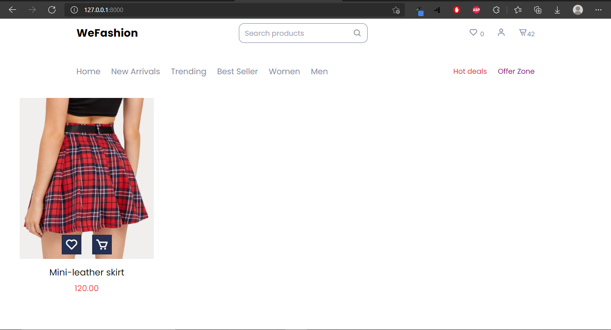
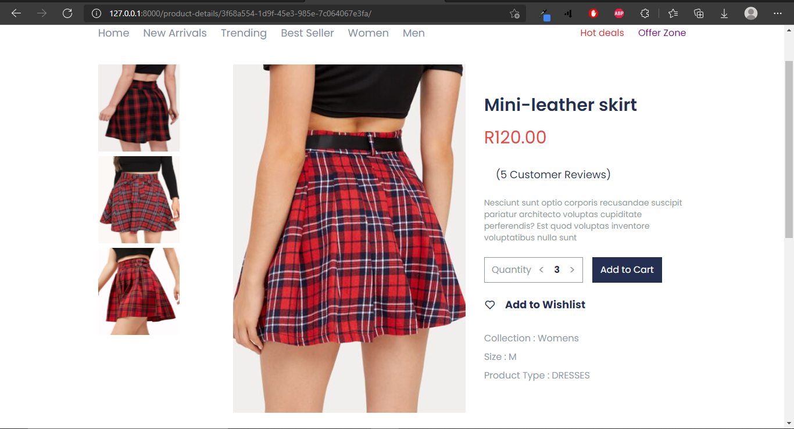
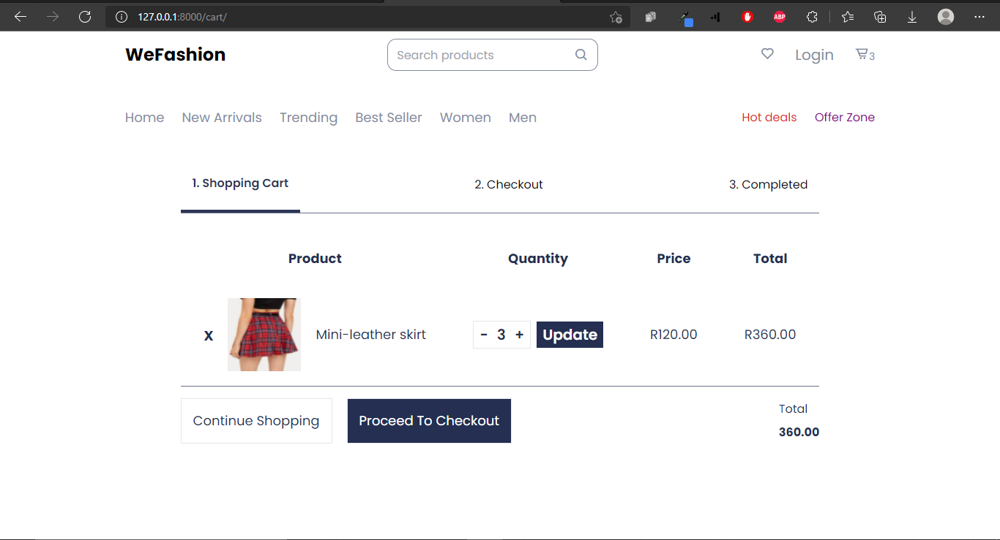

# WeFashion Django E-commerce Web app

## Description

Ecommerce website developed using django 3.1, postgresql 13, tailwindcss and JQuery. Visitors can view, add product to cart, & place order.

## Development Environment

- Windows 10
- VS Code

## Features

- Cart using session
- View Product reviews
- Add/Remove/Update product in Cart using JQuery Ajax requests
- Add/Remove/View product in Wishlist using JQuery Ajax requests
- Add product review using JQuery Ajax requests

## Features To Be Added(TODOs)

- Stripe payment
- Celery background email task
- Infinity scroll using JQuery Ajax request
- Product filtering using JQuery Ajax request
- Product search using JQuery Ajax request
- Authentication client-side tailwind styling

## Run The Project

- Add Your own Django database settings
- Add your own SECRET_KEY, Debug and Allowed_hosts
- Create development env and activate it
- pip install -r requirement.txt
- python manage.py tailwind install

## Documentation

### Home View

### Product Detail View

### Cart View

